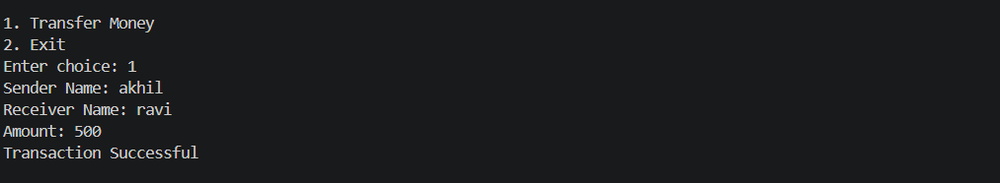
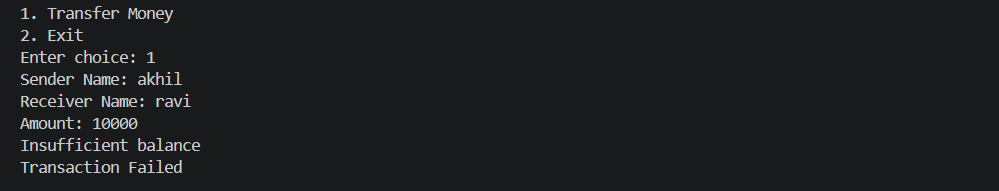
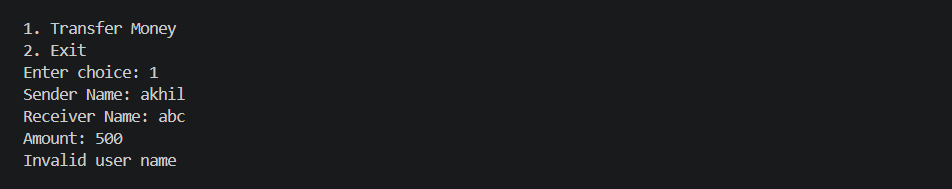
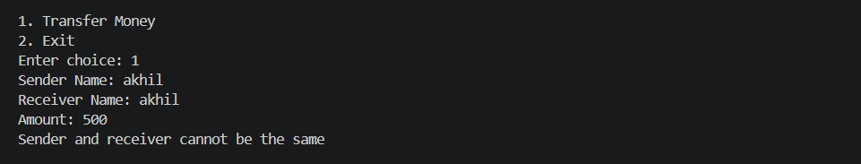

# Digital Wallet System (Java + JDBC)

## About the Project

This is a console-based digital wallet system built using Java and MySQL.

The goal of this project was to understand how real-world transactions work — especially how money transfer systems ensure consistency using database transactions.

The system allows users to transfer money between accounts while maintaining data integrity using commit and rollback.

---

## Features

* Transfer money between users
* Check balance before transaction
* Store transaction history (SUCCESS / FAILED)
* Rollback if transaction fails
* Transfer using user names (instead of IDs)

---

## Technologies Used

* Java (Core Java, OOP concepts)
* JDBC (Java Database Connectivity)
* MySQL

---

## Project Structure

```
wallet-system/
 ├── src/
 │    ├── dao/
 │    ├── service/
 │    ├── main/
 │    ├── model/
 ├── database.sql
 ├── README.md
 ├── .gitignore
```

---

## How to Run

### 1. Setup Database

* Open MySQL Workbench
* Create a database named:

```
walletdb
```

* Run the `database.sql` file

---

### 2. Configure Database Connection

Open `DBConnection.java` and update:

```java
private static final String USER = "root";
private static final String PASSWORD = "your_password";
```

---

### 3. Compile and Run

```
javac -d out src/dao/*.java src/service/*.java src/main/*.java src/model/*.java
java -cp "out;mysql-connector-j-8.0.33.jar" main.MainApp
```

---

## Sample Outputs

### 1. Successful Transaction




---

### 2. Insufficient Balance



---

### 3. Invalid User Name



---

### 4. Same Sender and Receiver



---

### 5. Database Error (if MySQL not running)

```
java.sql.SQLException: No suitable driver found for jdbc:mysql://localhost:3306/walletdb
```

---

## Database Tables

### users

* user_id (Primary Key)
* name (Unique)
* phone

### wallet

* user_id (Primary Key)
* balance

### transactions

* id (Primary Key)
* sender_id
* receiver_id
* amount
* status
* timestamp

---

## What I Learned

* How JDBC connects Java with MySQL
* How transactions work using commit and rollback
* How to structure a project using DAO and service layers
* Basic backend system design

---

## Limitations

* Console-based (no UI)
* No authentication system
* Input is case-sensitive

---

## Future Improvements

* Add login and authentication
* Display transaction history
* Convert into REST API using Spring Boot
* Build web interface

---

## Author

Akhil Reddy
